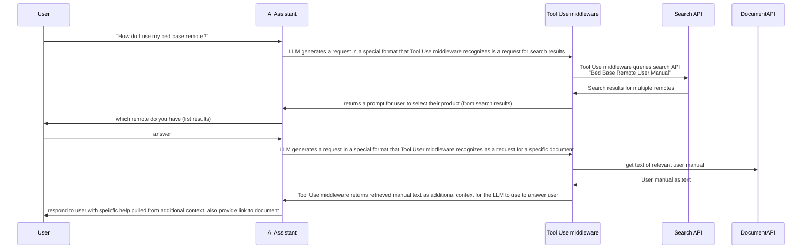
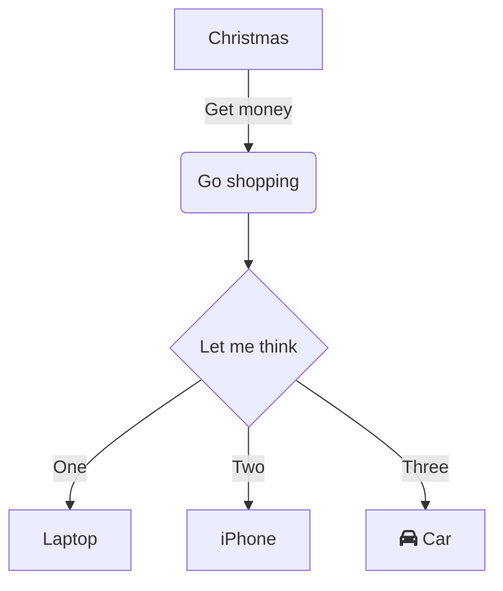

**Note**: This article was written for a mostly non-technical audience. While researching AI vendor partners with some clients, we wanted to demystify how LLMs are actually used in production, without using too much jargon.
 
## How to get AI to "know things"
State of the art LLMs are trained on huge datasets, often at the size of "the whole internet". This allows the LLMs to answer questions with broad and deep expertise. However, any information _not in the training dataset_ is not "known" to the LLM. This poses a problem if we want the LLM to answer questions about a specific dataset.
So how do we teach an LLM new things?

### 1. Training a new model from scratch
We could attempt to build a brand new LLM on _just_ the data for our problem domain. However, this dataset isn't big enough to train an LLM with the advanced reasoning capabilities of a ChatGPT level model.
And even if we did have enough data, it's also _very expensive_ to train a foundational model.

### 2. Fine Tuning
What if we could _teach_ an already smart foundational model to do a more specific task, like answering customer service questions? **Fine Tuning** allows us to take a foundational (open source) model, like Qwen or LLama, and _additionally train_ it on domain specific data.
For example, to train an LLM to be a customer service chatbot, we could prepare a dataset of customer service questions and known answers, then fine tune the base model with that additional data. This _should_ result in a model that is tuned to respond as a reasonably smart customer service rep.
This is still fairly expensive to do, as it requires GPU compute time to fine tune a model. Results will also vary depending on the size of the training dataset, and the quality of questions/answers.
Also, because the base model knows about much more than the fine tuning dataset, it can answers questions well outside the scope of its task. For example, with some nefarious **prompt engineering**, a user may be able to get the chatbot to generate instructions on how to build a bomb. 😬

### 3. Prompt Engineering and Prompt Stuffing
For some tasks, a foundational model may be good enough so long as all the relevant information is in the incoming prompt. 
For example, say we want to build a customer service chatbot that answers questions about a specific product, and say we have a 10 page customer service manual for that product. We could just stick the entire text of the customer service manual into the prompt before the customer query. This is often called **prompt stuffing**. 
We can instruct the LLM to respond in the manner of a customer service agent. For example, we could ask "Respond in the manner of a polite and helpful customer service agent. Use a warm and professional tone." This is often called **prompt engineering**.
The format of the prompt we send to the LLM may look like this:
- general instructions on the task
	- Act as a customer service agent. Use a friendly and professional tone.
	- Only answer questions within the scope of the data provided below
	- Don't answer questions about politics, religion, or sex, etc
- relevant data
	- the user manual and other documentation
	- example FAQ -> answers
- customer query
	- whatever the customer just asked
The costs for this approach are _much_ smaller (in some cases free) compared to training. 
This approach has the same potential risks as using a fine tuned model, in that clever prompt engineering can get the chatbot to go "off script".

### 4. Retrieval Augmented Generation (RAG)
What if our relevant data is too big to fit into a prompt? Say we are building a customer service chatbot not for just one product, but for a brand's entire product catalog. Let's say the customer service resources are available on a searchable web portal. We could use this search portal to provide relevant search results to help generate specific answers to a customer question.
Here's how that might work:

This approach requires some kind of **Tool Use Middleware** that can look at LLM output and determine if/when the LLM is "asking" to search or retrieve a document.
This approach also **assumes that relevant data is available and queryable**. If this isn't the case, this approach will require building such a tool.
This approach is basically an extension of **prompt stuffing**, where we add relevant context _into_ the chat context. 
**Note**: neither this or prompt stuffing will "teach" the LLM anything new. The LLM only "knows" what has been added to the chat context. Once the chat is finished, it "forgets" any previous chats.

## How to get AI to "do things"
At their core, LLMs take input data and return output data. For chatbots, users enter text, the chatbot outputs text. Given this limitation, how do we get LLM powered tools to actually _do something_ other than spit out more text?

### 1. Tool Use (Function Calling)
Tool use (often called "function calling") allows AI models to interact with external systems and perform actions beyond text generation. The **4. Retrieval Augmented Generation (RAG)** section above is an example of tool use, as we gave the LLM the ability to 1. Search for Data and 2. Retrieve documents.
**How it works:**
- The AI identifies when a user request requires external action
- The AI generates a structured request to an external tool/function
- The application intercepts this request and executes the actual function
- Results are returned to the AI, which incorporates them into its response
**Real-world examples:**
- Booking a restaurant reservation by connecting to a booking API
- Checking weather by accessing weather service data
- Creating calendar events that actually appear in your calendar
- Sending emails through your email provider
- Running calculations in spreadsheets
- Controlling smart home devices

### 2. Rendering markup languages and other text based formats
Chatbots output text, but that text isn't limited to English prose.
For example, chatbots can output code snippets. Often, chatbots will use the standard [Markdown Code Block syntax](https://www.markdownguide.org/basic-syntax/#code-blocks-1) to render code snippets like so:

```python
print("This is some example code")
```

If you're reading this on github, you will see the above statement formatted as monospace. (You can view the raw source of this file to see what this looks like before being rendered). 
This works because github supports Markdown rendering. We could also use a Markdown rendering engine to display the code block as monospace in a chatbot app. 
Also, because this format cleanly delineates code from prose, we could parse the LLM output to look for code snippets, and stuff that code into an web based IDE tool to provide the user the option to interact with that code. We could also (with extreme caution) execute code written by the LLM.
We could also ask the LLM to generate valid HTML, which we could render to the end user in a HTML preview app.

```HTML
<h2>Hello world!</h2>
```

Our LLM could also generate [LaTex](https://www.wikiwand.com/en/articles/LaTeX) syntax to display mathmatical notation.


$$
  \begin{align}
    E_0 &= mc^2 \\
    E &= \frac{mc^2}{\sqrt{1-\frac{v^2}{c^2}}}
  \end{align} 
$$


We could ask the LLM to use [Mermaid Diagram Syntax](https://mermaid.js.org/intro/syntax-reference.html) to render diagrams.



We could also ask the LLM to generate tabular data in the CSV format, which we can then display as a table and/or import into a spreadsheet application

```csv
product,unit cost,unit profit
super cola, 0.99, 0.90
diet super cola, 0.99, 0.95
```

What all the above examples have in common: we ask the LLM for a text format, but use that text to render something more than text. The lesson here is that **any text based data format can be generated by an LLM**, though your results may vary. Also to note, I've found that LLMs generally render decent output for Mermaid diagrams, but struggle to interpret Mermaid diagrams put into the prompt. Again, this will vary depending on the model's training data.
